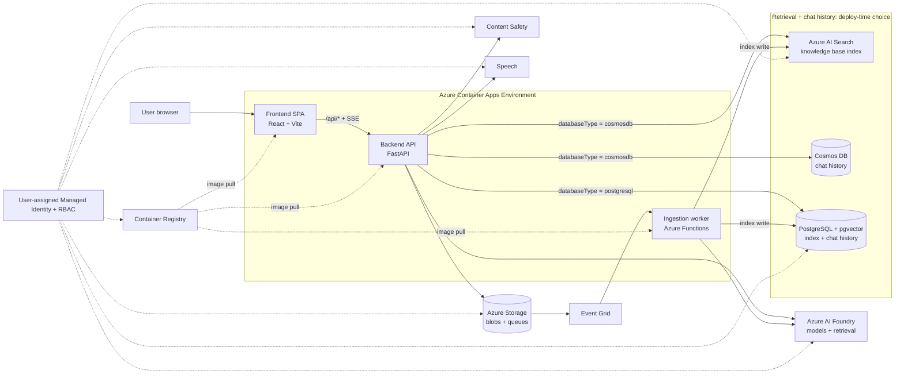

<!-- YAML front-matter schema: https://review.learn.microsoft.com/en-us/help/contribute/samples/process/onboarding?branch=main#supported-metadata-fields-for-readmemd -->

# Chat with Your Data

Ground a conversational assistant in your own documents and get answers with inline citations back to the source.

Organizations hold vast unstructured knowledge in contracts, policies, product manuals, and benefit guides that is hard to search and slow to answer questions from. Chat with Your Data indexes that content and puts a natural-language chat experience in front of it, so people find grounded answers in seconds instead of digging through files. Everything deploys into your own Azure subscription with a single `azd up`.

<div align="center">

[Solution overview](#solution-overview) &nbsp;&bull;&nbsp; [Key features](#key-features) &nbsp;&bull;&nbsp; [Deploy](#deploy) &nbsp;&bull;&nbsp; [Documentation](#supporting-documentation)

</div>

> [!NOTE]
> This accelerator is a starting point, not a turnkey production system. Evaluate retrieval quality, answer accuracy, and responsible-AI considerations against your own data before you rely on it. See the [Responsible AI Transparency FAQ](#responsible-ai-transparency-faq).

## Solution overview

### Architecture

<!-- Screenshot slot: replace the Mermaid diagram below with a rendered architecture screenshot if you prefer a static image. -->



The solution runs entirely on Azure Container Apps: a React single-page app, a FastAPI backend, and an Azure Functions ingestion worker. The backend calls Azure AI Foundry for models and retrieval, and reads and writes its index and chat history in either Azure AI Search with Cosmos DB or PostgreSQL with pgvector, chosen at deploy time. A user-assigned managed identity authorizes every call through Azure RBAC, so there is no Key Vault and there are no application secrets to manage.

### How it works

You ask a question in natural language. The backend retrieves the most relevant passages from your indexed documents, grounds a language model on that context, and streams the answer back to the browser with inline citations to the source documents. Ingestion runs separately: documents you upload or web pages you point at are parsed, chunked, embedded, and written to the retrieval index, ready for the next question.

### Additional resources

- [Azure AI Foundry documentation](https://learn.microsoft.com/azure/ai-foundry/)
- [Azure Container Apps documentation](https://learn.microsoft.com/azure/container-apps/)
- [Azure Functions documentation](https://learn.microsoft.com/azure/azure-functions/)
- [Azure Developer CLI (azd) documentation](https://learn.microsoft.com/azure/developer/azure-developer-cli/)

## Key features

- **Grounded answers with citations**: responses are grounded in your indexed content and cite the source documents inline.
- **Document ingestion pipeline**: upload files or index public web pages; the pipeline parses, chunks, and embeds many [file types](docs/supported_file_types.md).
- **Database flexibility**: choose Azure AI Search with Cosmos DB or PostgreSQL with pgvector at deploy time.
- **Managed-identity security**: a single user-assigned managed identity and Azure RBAC, with no Key Vault and no application secrets. See [Managed identity and RBAC](docs/managed_identity.md).
- **Conversational web app**: a single-page chat interface with streaming responses and persistent [chat history](docs/chat_history.md).
- **Admin and configuration surface**: ingest, inspect, and configure your dataset and prompts from the built-in [admin experience](docs/admin.md).
- **Speech-to-text input**: ask questions by voice with [speech-to-text](docs/speech_to_text.md).

## Deploy

### Prerequisites

| Requirement | Details |
|-------------|---------|
| Azure subscription | With rights to create resources and role assignments (Owner, or Contributor plus User Access Administrator). [Create one for free](https://azure.microsoft.com/free/). |
| Azure Developer CLI (azd) | Version `>= 1.18.0` (and not `1.23.9`). [Install azd](https://learn.microsoft.com/azure/developer/azure-developer-cli/install-azd). |
| Azure CLI (az) | Used for sign-in and supporting commands. [Install the Azure CLI](https://learn.microsoft.com/cli/azure/install-azure-cli). |
| Docker | Required for local development. Not required for `azd up`, which builds the container images remotely. [Install Docker Desktop](https://www.docker.com/products/docker-desktop/). |
| Model capacity | Deploy to a region with Azure AI Foundry model capacity. Check availability first with the [quota check](docs/QuotaCheck.md) and [model quota settings](docs/azure_openai_model_quota_settings.md) guides. |

### Deploy with azd

`azd up` is the only supported deployment path. From the repository root:

```bash
azd auth login
azd up
```

`azd up` provisions the infrastructure, builds and pushes the container images, deploys the three services, and seeds the sample corpus. It prompts you for:

- Environment name, target Azure subscription, and deployment location.
- Database engine: `cosmosdb` (Cosmos DB with Azure AI Search) or `postgresql` (PostgreSQL with pgvector). This choice is locked after deploy.
- Azure AI service location: the region for Azure AI Foundry models.
- Optional hardening flags: monitoring, scalability, redundancy, and private networking.

When it finishes, `azd` prints the application URL. For the full walkthrough, prerequisites, and post-deployment verification, see the [deployment guide](docs/LOCAL_DEPLOYMENT.md). To change parameters before deploying, see [Customizing azd parameters](docs/customizing_azd_parameters.md).

### Costs

This accelerator deploys several billable services. Estimate cost with the [Azure pricing calculator](https://azure.microsoft.com/pricing/calculator/) and review the per-service pricing below.

| Service | Purpose | Pricing |
|---------|---------|---------|
| Azure Container Apps | Hosts the web app, backend API, and ingestion worker. | [Pricing](https://azure.microsoft.com/pricing/details/container-apps/) |
| Azure Container Registry | Stores the container images the workload pulls. | [Pricing](https://azure.microsoft.com/pricing/details/container-registry/) |
| Azure AI Foundry | Chat, embedding, and retrieval models. | [Pricing](https://azure.microsoft.com/pricing/details/cognitive-services/openai-service/) |
| Azure AI Search | Retrieval index in `cosmosdb` mode. | [Pricing](https://azure.microsoft.com/pricing/details/search/) |
| Azure Document Intelligence | Parses uploaded documents. | [Pricing](https://azure.microsoft.com/pricing/details/ai-document-intelligence/) |
| Azure Storage | Stores ingestion blobs and processing queues. | [Pricing](https://azure.microsoft.com/pricing/details/storage/blobs/) |
| Azure Functions | Runs the ingestion pipeline. | [Pricing](https://azure.microsoft.com/pricing/details/functions/) |
| Azure Cosmos DB or PostgreSQL | Chat history and, in `postgresql` mode, the index. | [Cosmos DB](https://azure.microsoft.com/pricing/details/cosmos-db/), [PostgreSQL](https://azure.microsoft.com/pricing/details/postgresql/flexible-server/) |
| Azure AI Speech | Speech-to-text input. | [Pricing](https://azure.microsoft.com/pricing/details/cognitive-services/speech-services/) |
| Application Insights | Optional monitoring and diagnostics. | [Pricing](https://azure.microsoft.com/pricing/details/monitor/) |

> [!IMPORTANT]
> Resources continue to incur charges until you delete them. Run `azd down` when you are finished to avoid ongoing costs.

### Clean up

Remove every resource this accelerator created:

```bash
azd down
```

## Supporting documentation

### Documentation index

| Guide | What it covers |
|-------|----------------|
| [Architecture overview](docs/architecture.md) | How the solution is composed on Azure. |
| [Deploy with azd](docs/LOCAL_DEPLOYMENT.md) | Full `azd up` walkthrough and verification. |
| [Customize azd parameters](docs/customizing_azd_parameters.md) | Parameters to set before deploying. |
| [Local development](docs/LocalDevelopmentSetup.md) | Run the stack locally with Docker Compose. |
| [Admin and configuration](docs/admin.md) | Ingest, inspect, and configure your data and prompts. |
| [Document ingestion](docs/document_ingestion.md) | How documents are parsed, chunked, and indexed. |
| [Supported file types](docs/supported_file_types.md) | File formats the pipeline accepts. |
| [Streaming responses](docs/streaming_responses.md) | How answers stream to the browser. |
| [Chat history](docs/chat_history.md) | How conversations are stored and retrieved. |
| [Managed identity and RBAC](docs/managed_identity.md) | The identity model and role assignments. |
| [Authentication setup](docs/authentication_setup.md) | Add end-user sign-in to the web app. |
| [Model configuration](docs/model_configuration.md) | Configure models and prompts. |
| [Model quota settings](docs/azure_openai_model_quota_settings.md) | Manage Azure AI Foundry model quota. |
| [Quota check](docs/QuotaCheck.md) | Verify model capacity before deploying. |
| [PostgreSQL option](docs/postgreSQL.md) | Deploy with PostgreSQL and pgvector. |
| [Speech-to-text](docs/speech_to_text.md) | Voice input configuration. |
| [Post-deployment hardening](docs/AVMPostDeploymentGuide.md) | WAF-aligned post-deployment steps. |
| [Troubleshooting](docs/TroubleShootingSteps.md) | Common issues and fixes. |
| [Responsible AI FAQ](docs/transparency_faq.md) | Responsible-AI transparency information. |

### Security

Chat with Your Data authenticates to Azure with a single user-assigned managed identity, and every downstream call is authorized through Azure RBAC. There is no Key Vault and there are no application secrets to store or rotate. See [Managed identity and RBAC](docs/managed_identity.md) for the identity model and role assignments.

- Keep secret scanning enabled on your fork so credentials are never committed.
- For stricter isolation, enable the private-networking hardening flag at deploy time to place data-plane resources behind a virtual network and private endpoints.
- Consider Microsoft Defender for Cloud for continuous posture monitoring.

## Legacy release

An earlier release of this accelerator lives under [`cwyd-v1/`](cwyd-v1/). It used a different hosting model and a one-click deployment button in the Azure portal, and is retained for reference only. New deployments should use the `azd up` flow described above.

## Provide feedback

Found a problem or have an idea? [Open an issue](https://github.com/Azure-Samples/chat-with-your-data-solution-accelerator/issues) in this repository.

## Responsible AI Transparency FAQ

Review how this accelerator handles responsible-AI considerations in the [Responsible AI Transparency FAQ](docs/transparency_faq.md).

## License

This repository is licensed under the [MIT License](LICENSE.md). The dataset under the `data/` folder is licensed under the [CDLA-Permissive-2 License](CDLA-Permissive-2.md).

## Disclaimers
This Software requires the use of third-party components which are governed by separate proprietary or open-source licenses as identified below, and you must comply with the terms of each applicable license in order to use the Software. You acknowledge and agree that this license does not grant you a license or other right to use any such third-party proprietary or open-source components.

To the extent that the Software includes components or code used in or derived from Microsoft products or services, including without limitation Microsoft Azure Services (collectively, “Microsoft Products and Services”), you must also comply with the Product Terms applicable to such Microsoft Products and Services. You acknowledge and agree that the license governing the Software does not grant you a license or other right to use Microsoft Products and Services. Nothing in the license or this ReadMe file will serve to supersede, amend, terminate or modify any terms in the Product Terms for any Microsoft Products and Services.

You must also comply with all domestic and international export laws and regulations that apply to the Software, which include restrictions on destinations, end users, and end use. For further information on export restrictions, visit https://aka.ms/exporting.

You acknowledge that the Software and Microsoft Products and Services (1) are not designed, intended or made available as a medical device(s), and (2) are not designed or intended to be a substitute for professional medical advice, diagnosis, treatment, or judgment and should not be used to replace or as a substitute for professional medical advice, diagnosis, treatment, or judgment. Customer is solely responsible for displaying and/or obtaining appropriate consents, warnings, disclaimers, and acknowledgements to end users of Customer’s implementation of the Online Services.

You acknowledge the Software is not subject to SOC 1 and SOC 2 compliance audits. No Microsoft technology, nor any of its component technologies, including the Software, is intended or made available as a substitute for the professional advice, opinion, or judgement of a certified financial services professional. Do not use the Software to replace, substitute, or provide professional financial advice or judgment.

BY ACCESSING OR USING THE SOFTWARE, YOU ACKNOWLEDGE THAT THE SOFTWARE IS NOT DESIGNED OR INTENDED TO SUPPORT ANY USE IN WHICH A SERVICE INTERRUPTION, DEFECT, ERROR, OR OTHER FAILURE OF THE SOFTWARE COULD RESULT IN THE DEATH OR SERIOUS BODILY INJURY OF ANY PERSON OR IN PHYSICAL OR ENVIRONMENTAL DAMAGE (COLLECTIVELY, “HIGH-RISK USE”), AND THAT YOU WILL ENSURE THAT, IN THE EVENT OF ANY INTERRUPTION, DEFECT, ERROR, OR OTHER FAILURE OF THE SOFTWARE, THE SAFETY OF PEOPLE, PROPERTY, AND THE ENVIRONMENT ARE NOT REDUCED BELOW A LEVEL THAT IS REASONABLY, APPROPRIATE, AND LEGAL, WHETHER IN GENERAL OR IN A SPECIFIC INDUSTRY. BY ACCESSING THE SOFTWARE, YOU FURTHER ACKNOWLEDGE THAT YOUR HIGH-RISK USE OF THE SOFTWARE IS AT YOUR OWN RISK.
