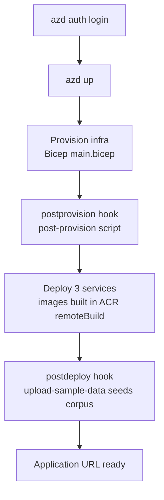

[Back to *Chat with your data* README](../README.md)


## Overview

Chat with Your Data deploys to Azure with the Azure Developer CLI (`azd`). One command provisions every resource, builds the three container images, deploys them to Azure Container Apps, and seeds a sample corpus so chat works on the first run. There is no portal template and no one-click button to configure.

Estimated time: 20 to 40 minutes, most of which is unattended provisioning.

## Prerequisites

* An Azure subscription with permission to create resources and assign roles. See [Managed identity and RBAC](managed_identity.md) for the roles the deployment assigns.
* [Azure Developer CLI](https://learn.microsoft.com/azure/developer/azure-developer-cli/install-azd) version 1.18.0 or later. Version 1.23.9 is not supported.
* [Azure CLI](https://learn.microsoft.com/cli/azure/install-azure-cli).
* Model capacity for the chat and embedding models in your target region. See [Azure OpenAI model quota settings](azure_openai_model_quota_settings.md) and [Quota check](QuotaCheck.md).

> [!TIP]
> The default AI service region is `eastus2`. Choose a region that has capacity for the configured models, or set a different region at the prompt.

## Deploy with azd

Sign in, then provision and deploy in one step.

```bash
azd auth login
azd up
```

`azd up` prompts for a few typed parameters and stores them in your azd environment.

| Prompt | Values | Notes |
|--------|--------|-------|
| `databaseType` | `cosmosdb` (default), `postgresql` | Chooses the retrieval index and chat history platform. Locked after deployment. |
| `azureAiServiceLocation` | Azure region | Region for the Azure AI Foundry models. Defaults to `eastus2`. |
| `enableMonitoring` | `true`, `false` | Adds Log Analytics and Application Insights. Defaults to `false`. |
| `enableScalability` | `true`, `false` | Reliability and scale flag. Defaults to `false`. |
| `enableRedundancy` | `true`, `false` | Redundancy flag. Defaults to `false`. |
| `enablePrivateNetworking` | `true`, `false` | Adds a virtual network, private DNS, and a bastion host. Defaults to `false`. |

See [Customizing azd parameters](customizing_azd_parameters.md) for the complete list of options.

## What azd up does



1. **Provision.** Bicep (`infra/main.bicep`) creates the resource group contents described in [Architecture overview](architecture.md).
2. **Post-provision.** A script prepares data-plane state, such as enabling the `pgvector` extension in `postgresql` mode or seeding the knowledge base in `cosmosdb` mode.
3. **Deploy.** The backend, frontend, and ingestion images build remotely in the container registry, so you do not need Docker installed. The Container Apps are then updated to the new images.
4. **Post-deploy.** A script seeds a sample document set and enqueues it for ingestion so chat returns grounded answers immediately.

When the command finishes, `azd` prints the application URL.

## Deploy changes to a single service

After the first `azd up`, you can redeploy one service without reprovisioning.

```bash
azd deploy backend
azd deploy frontend
azd deploy function
```

## Clean up

Delete every resource created by the deployment when you are done.

```bash
azd down
```

> [!WARNING]
> `azd down` permanently deletes the deployed resources and all ingested data. Export anything you need first.

## Related documentation

* [Architecture overview](architecture.md)
* [Local development](LocalDevelopmentSetup.md)
* [Customizing azd parameters](customizing_azd_parameters.md)
* [Troubleshooting steps](TroubleShootingSteps.md)
