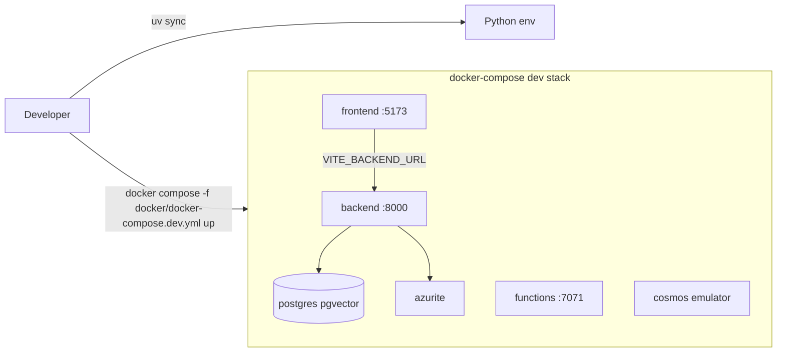

[Back to *Chat with your data* README](../README.md)


## Overview

The local development stack runs all three services and their dependencies with Docker Compose. Python tooling is managed with [uv](https://docs.astral.sh/uv/), which creates a single environment for the whole repository. The local stack uses PostgreSQL with `pgvector` for retrieval and chat history so you can develop without any cloud resources.

## Prerequisites

* [Docker Desktop](https://www.docker.com/products/docker-desktop/) or a compatible Docker engine.
* [uv](https://docs.astral.sh/uv/getting-started/installation/).
* [Node.js](https://nodejs.org/) if you want to run the frontend outside of Docker.

## Set up the Python environment

Run this once from the repository root to create the environment.

```bash
uv sync
```

## Start the stack

```bash
docker compose -f docker/docker-compose.dev.yml up
```



## Services and ports

| Service | Port | Purpose |
|---------|------|---------|
| Backend API | 8000 | FastAPI app with hot reload. Health at `/api/health`. |
| Frontend | 5173 | React and Vite app. Reads the backend origin from `VITE_BACKEND_URL`. |
| Functions | 7071 | Ingestion worker. |
| Azurite | 10000 to 10002 | Local blob, queue, and table storage. |
| PostgreSQL | 5432 | `pgvector`-enabled database for retrieval and chat history. |
| Cosmos emulator | 8081 | Optional. Enabled with the `cosmos` profile. |

The default stack pins the PostgreSQL data mode with `AZURE_DB_TYPE=postgresql` and `AZURE_INDEX_STORE=pgvector`, so retrieval and chat history both use the local database.

## Profiles

Use a profile to run a subset of the stack.

```bash
# Backend and its dependencies only, no frontend
docker compose -f docker/docker-compose.dev.yml --profile backend-only up

# Frontend only, pointed at an external backend
VITE_BACKEND_URL=https://<your-backend-host> docker compose -f docker/docker-compose.dev.yml --profile frontend-only up

# Add the Cosmos DB emulator
docker compose -f docker/docker-compose.dev.yml --profile cosmos up
```

The `backend-only` profile proves the backend runs headless with no frontend dependency. The `frontend-only` profile serves the web app against any backend you point `VITE_BACKEND_URL` at.

## Configuration

Copy the sample environment file and adjust values as needed.

```bash
cp .env.sample .env
```

The `.env` file is optional for the `backend-only` profile, so a fresh checkout boots the backend without any configuration.

## Run the frontend outside Docker

To iterate on the web app with the Vite dev server, run it directly.

```bash
cd src/frontend
npm install
npm run dev
```

Set `VITE_BACKEND_URL` to the backend origin, for example `http://localhost:8000`.

## Related documentation

* [Architecture overview](architecture.md)
* [Deploy with azd](LOCAL_DEPLOYMENT.md)
* [Admin and configuration](admin.md)
