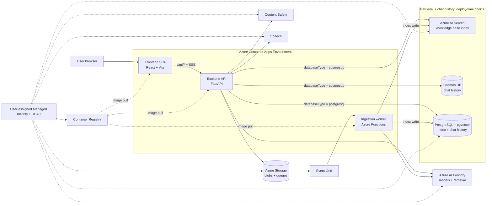

[Back to *Chat with your data* README](../README.md)

## Overview

Chat with Your Data grounds a chat assistant in your own documents. Users ask questions in a web app, the backend retrieves the most relevant passages from an indexed corpus, and Azure AI Foundry generates an answer with inline citations back to the source documents. Everything runs on Azure Container Apps and authenticates with a managed identity, so there are no application secrets to store or rotate.

> [!NOTE]
> The diagram below is authored in Mermaid. Export it and replace it with a rendered screenshot if you prefer a static image.

## System architecture

## How it works

1. A user signs in to the web app and asks a question.
2. The backend retrieves the most relevant passages from the vector index.
3. The question and the retrieved passages are sent to Azure AI Foundry.
4. Foundry streams a grounded answer, and the backend attaches citations to the source documents.
5. The web app renders the streamed answer, a progress panel, and the source citations.

## Runtime components

Three services deploy to a single Azure Container Apps environment.

| Service | Technology | Responsibility |
|---------|------------|----------------|
| Web app | React and Vite | Chat UI, citations, progress panel, and the built-in admin pages. |
| Backend API | FastAPI | Chat, chat history, admin, speech token, file streaming, and health endpoints. Runs headless. |
| Ingestion worker | Azure Functions | Parses, chunks, embeds, and indexes uploaded documents and URLs. |

The web app reads the backend origin at runtime, so the same image works in every environment. See [Local development](LocalDevelopmentSetup.md) for how the three services run together on your machine.

## Data modes

The data platform is chosen once, at deployment time, through the `databaseType` prompt. It cannot be changed after deployment.

| Mode | Retrieval index | Chat history |
|------|-----------------|--------------|
| `cosmosdb` (default) | Azure AI Search | Azure Cosmos DB |
| `postgresql` | PostgreSQL with the `pgvector` extension | PostgreSQL |

In `cosmosdb` mode, retrieval uses an Azure AI Search index and an Azure AI Foundry knowledge base. In `postgresql` mode, a single PostgreSQL Flexible Server holds both the vector index and the chat history, and no Azure AI Search resource is deployed. See [Chat history](chat_history.md) and [PostgreSQL](postgreSQL.md) for the storage details.

## Orchestrators

Chat answers are produced by an orchestrator. Two ship with the application, and both return grounded answers with inline citations back to the source documents.

| Orchestrator | Retrieval approach |
|--------------|--------------------|
| `agent_framework` | Delegates to an Azure AI Foundry agent. In `cosmosdb` mode it grounds through an Azure AI Foundry knowledge base over the Azure AI Search index; in `postgresql` mode it grounds app-side over the `pgvector` index. |
| `langgraph` | Runs an application-owned retrieval pipeline and works the same way on either index store. |

Either orchestrator runs against either data mode. Switching the orchestrator is a runtime decision, and the switch is served on whichever index store the deployment uses.

At deployment time, `azd up` sets the default orchestrator automatically from the `databaseType` choice: `postgresql` selects `langgraph`, and `cosmosdb` selects `agent_framework`. There is no separate orchestrator prompt, so the default follows the database choice.

The default is a starting point, not a lock. An operator can switch orchestrators at runtime from the admin Configuration page without redeploying. See [Admin and configuration](admin.md#configuration).

## Provisioned resources

`azd up` provisions roughly twenty-one resources. The always-on set includes the managed identity, the Azure AI Foundry account and project, Speech, Content Safety, Storage, the Container Apps environment and its three apps, the container registry, and an Event Grid system topic. Monitoring, networking, and the database or search resources are added based on your deployment choices. See [Customizing azd parameters](customizing_azd_parameters.md) for the full list of options.

## Security posture

A single user-assigned managed identity holds every role assignment the workload needs, and application configuration is passed as environment variables rather than stored in a secret store. See [Managed identity and RBAC](managed_identity.md) for details.

## Additional resources

* [Deploy with azd](LOCAL_DEPLOYMENT.md)
* [Document ingestion](document_ingestion.md)
* [Streaming answers and citations](streaming_responses.md)
* [Admin and configuration](admin.md)
