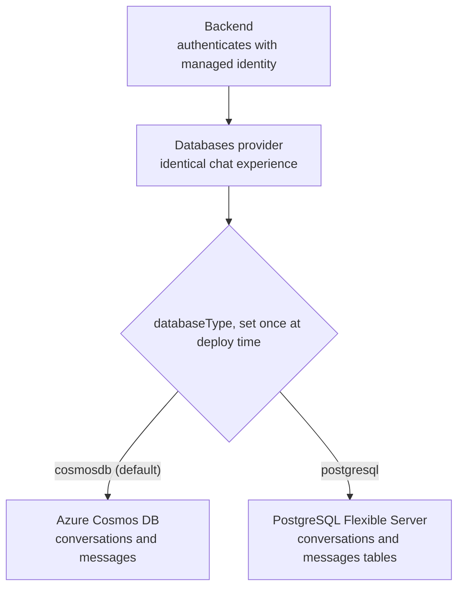

[Back to *Chat with your data* README](../README.md)

## Overview

Chat with Your Data lets people hold a conversation with their own documents. Chat history keeps a record of those conversations so users can revisit past interactions for reference, auditing, or compliance. This guide explains where chat history is stored and how users work with it.

## Where chat history is stored

Chat history is written to the deployment's database. The database is chosen once, at deployment time, through the `databaseType` parameter, which also determines where the retrieval index lives.

| Deployment mode | Chat history store |
|-----------------|--------------------|
| `cosmosdb` (default) | Azure Cosmos DB |
| `postgresql` | PostgreSQL Flexible Server |

Both modes store conversations and their messages through the same databases provider, so the chat experience is identical regardless of which one you deploy. The backend authenticates to the database with the workload's managed identity, so there are no connection-string secrets to manage. See [Architecture overview](architecture.md) for how the two modes fit together, and [PostgreSQL](postgreSQL.md) for the PostgreSQL schema. The following diagram traces that selection.

Chat history is enabled by default. Every conversation is saved as it happens, and reloading a conversation restores its messages and citations.

## View chat history

Users open their past conversations from the chat interface.

1. Select the chat history control to open the conversation panel.
2. The panel lists past conversations, newest first.
3. Select a conversation to reload its messages and continue where it left off.

*(Replace this with a screenshot of the conversation panel in your deployment.)*

## Rename a conversation

Give a conversation a meaningful title from the conversation panel so it is easier to find later.

## Delete chat history

Users manage their own conversations from the panel.

1. Open the conversation panel.
2. Find the conversation to remove.
3. Select the delete control next to it and confirm.

Deleting a conversation removes it and its messages from the database. Deleting history does not remove indexed documents; to manage documents, use the admin pages described in [Admin and configuration](admin.md).

## Related documentation

* [Architecture overview](architecture.md)
* [PostgreSQL](postgreSQL.md)
* [Managed identity and RBAC](managed_identity.md)
