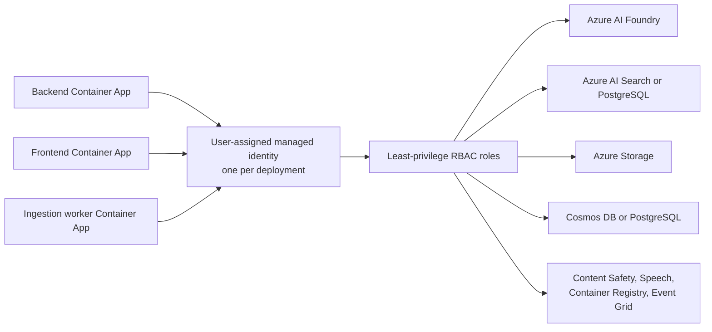

[Back to *Chat with your data* README](../README.md)

## Overview

Chat with Your Data authenticates to Azure with a single user-assigned managed identity. Every service the workload calls is authorized through Azure role-based access control (RBAC) rather than connection strings or keys. There is no Key Vault and there are no application secrets to store or rotate.

## One identity for the workload

The deployment creates one user-assigned managed identity and attaches it to the backend, the frontend, and the ingestion worker. Each Container App pulls its image and calls downstream services as that identity, so access is granted once and applies consistently across the three services. The following diagram shows the three services assuming the shared identity, which carries the least-privilege RBAC roles on each downstream Azure service.

## Role assignments

The deployment assigns the managed identity the least-privilege roles it needs on each resource.

| Target | Access |
|--------|--------|
| Azure AI Foundry | Call chat, embedding, and retrieval models. |
| Azure AI Search | Read and write the retrieval index (`cosmosdb` mode). |
| PostgreSQL | Read and write the index and chat history (`postgresql` mode). |
| Azure Storage | Read and write ingestion blobs and send messages to the processing queues. |
| Azure Cosmos DB | Read and write chat history (`cosmosdb` mode). |
| Content Safety | Screen prompts and responses. |
| Speech | Mint short-lived speech tokens. |
| Container Registry | Pull the container images. |
| Event Grid | Send blob events to the ingestion queue. |

## No application secrets

Application configuration is passed to the Container Apps as environment variables, and access to data services is granted through RBAC. Because there are no keys or connection strings in the application configuration, there is no secret store to manage.

> [!IMPORTANT]
> Keep environment-specific values, such as your subscription ID, resource group, and resource names, out of source control. Retrieve them from your azd environment with `azd env get-values`.

## Optional hardening

The deployment supports optional security features that you can enable at deployment time.

* Private networking adds a virtual network, private DNS zones, and a bastion host so data-plane traffic stays off the public internet. Enable it with the `enablePrivateNetworking` parameter.
* Enable Microsoft Defender for Cloud on the subscription to monitor the deployed resources.
* Enable secret scanning on your repository fork to catch accidental credential commits.

## Related documentation

* [Architecture overview](architecture.md)
* [App authentication setup](authentication_setup.md)
* [Customizing azd parameters](customizing_azd_parameters.md)
