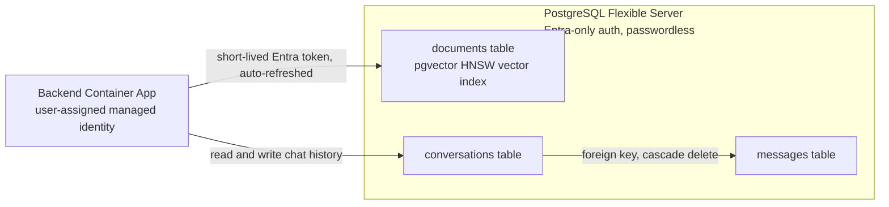

[Back to *Chat with your data* README](../README.md)


## Overview

Chat with Your Data can run on PostgreSQL. When you deploy with `databaseType=postgresql`, a single PostgreSQL Flexible Server holds both the retrieval index and the chat history, and no Azure AI Search resource is deployed. The other mode, `cosmosdb`, pairs Azure AI Search with Cosmos DB; see [Architecture overview](architecture.md) to compare them.

The following diagram shows the single server holding the vector index and the two chat-history tables, reached over a passwordless connection.



## Choosing PostgreSQL mode

Set the database type before you deploy:

```bash
azd env set AZURE_ENV_DATABASE_TYPE postgresql
azd up
```

The choice is locked after deployment. To switch, deploy a new environment.

## Passwordless authentication

The PostgreSQL server is configured for Microsoft Entra authentication only; password authentication is disabled. The application connects with the workload's user-assigned managed identity and a short-lived Entra token that is refreshed automatically, so there are no database passwords or connection-string secrets to store or rotate. The person who runs the deployment is set as the PostgreSQL Entra administrator by default; override this with the `AZURE_ENV_POSTGRES_ADMIN_PRINCIPAL_*` parameters. See [Managed identity and RBAC](managed_identity.md).

## Vector index

Retrieval uses the `pgvector` extension. The post-provision step enables the extension, and the application creates the `documents` table on first use. The table stores each chunk with its embedding:

```sql
CREATE EXTENSION IF NOT EXISTS vector;

CREATE TABLE IF NOT EXISTS documents (
    id              TEXT PRIMARY KEY,
    content         TEXT NOT NULL,
    title           TEXT,
    url             TEXT,
    last_modified   TIMESTAMPTZ NOT NULL DEFAULT now(),
    content_vector  vector(<dims>) NOT NULL
);

CREATE INDEX IF NOT EXISTS documents_vec_hnsw
    ON documents USING hnsw (content_vector vector_cosine_ops);
```

The vector width (`<dims>`) comes from the embedding model. `text-embedding-3-large` produces 3072-dimensional vectors; see [Model configuration](model_configuration.md). Changing the embedding dimension on an existing deployment requires recreating the table, because the column width is fixed when the table is first created.

Retrieval ranks chunks by cosine similarity over the embedding. When no query embedding is supplied, the provider falls back to PostgreSQL full-text search.

## Chat history

The same server stores chat history in two tables, created on first use:

* `conversations`: one row per conversation, keyed by a UUID and scoped to a user.
* `messages`: one row per message, linked to its conversation with a foreign key and cascade delete, and carrying the citations for assistant turns.

For how users work with chat history, see [Chat history](chat_history.md).

## Benefits

* **One data platform.** A single server holds both the vector index and the chat history, which keeps the deployment simple.
* **Secretless access.** Entra-only authentication with a managed identity means there are no database credentials to manage.
* **Scalable retrieval.** The `pgvector` HNSW index supports similarity search over large document sets.

## Related documentation

* [Architecture overview](architecture.md)
* [Chat history](chat_history.md)
* [Managed identity and RBAC](managed_identity.md)
* [Model configuration](model_configuration.md)
