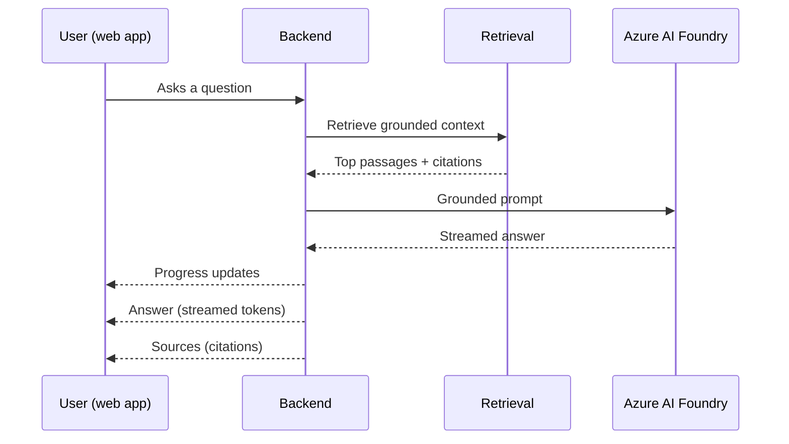

[Back to *Chat with your data* README](../README.md)

## Overview

Answers stream into the web app as they are generated, so users see a response take shape instead of waiting for a full reply. Alongside the answer, the app shows a collapsible progress panel and a set of source citations that link each claim back to the documents it came from.

## What the user sees

* The answer streams in token by token as the model generates it.
* A collapsible progress panel shows what the assistant is doing while it retrieves context and composes the answer. It stays out of the way and never mixes into the answer text.
* Source citations appear with the answer and point to the documents each claim came from, so users can verify every statement.

## How the stream is produced

The active orchestrator produces the stream. Either `agent_framework` or `langgraph` runs retrieval and generation, and it emits typed server-sent events on a reasoning channel as it works. The channel carries five event types: `reasoning`, `tool`, `answer`, `citation`, and `error`. Answer tokens arrive on `answer`, source references on `citation`, and any failure on `error`.

The collapsible progress panel renders the `reasoning` channel, so the assistant's intermediate thinking, including o-series reasoning output, stays in the panel and never mixes into the answer text. For how the two orchestrators differ and how the deployment default is chosen, see [Architecture overview](architecture.md#orchestrators).

## Request flow

## Grounding

Every answer is grounded in the retrieved passages. The backend sends the question and the top passages to Azure AI Foundry, and the model composes an answer that cites those passages. When no relevant content is found, the assistant says so rather than answering from general knowledge. For how documents get into the index, see [Document ingestion](document_ingestion.md).

## Related documentation

* [Architecture overview](architecture.md)
* [Document ingestion](document_ingestion.md)
* [Speech to text](speech_to_text.md)
